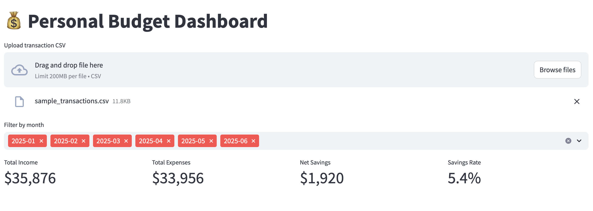
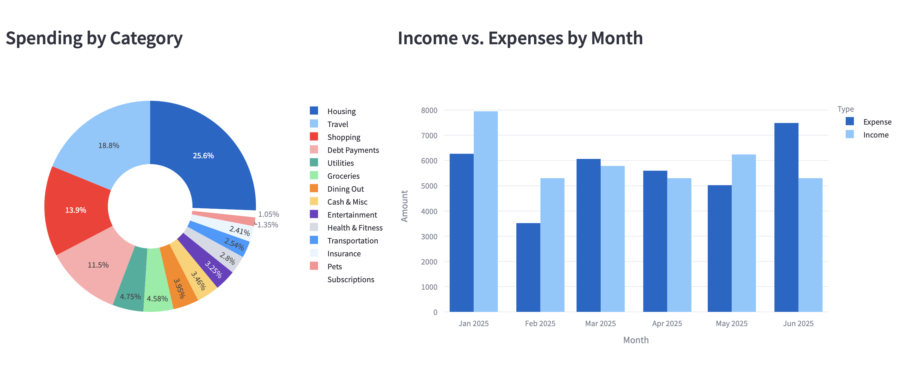
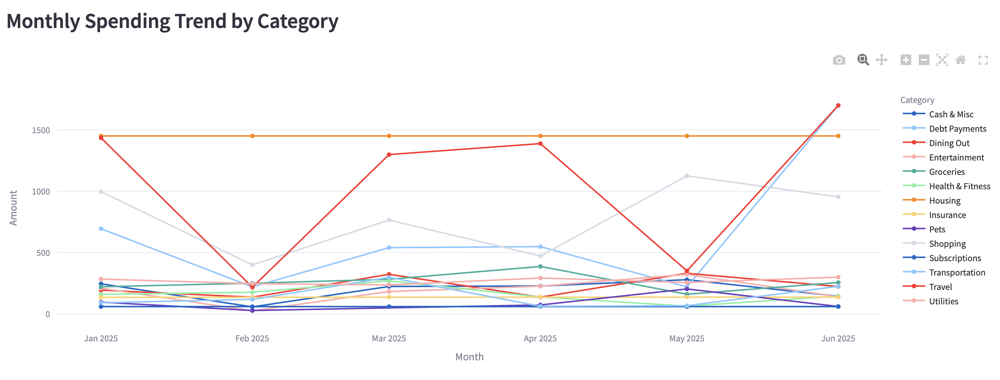
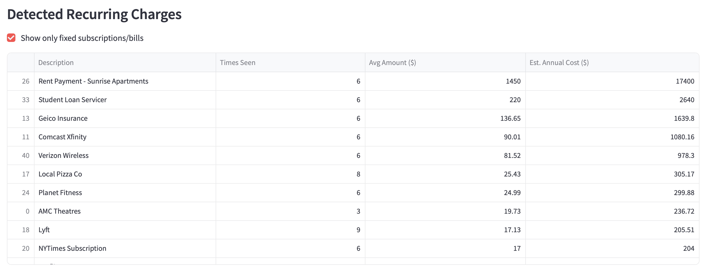
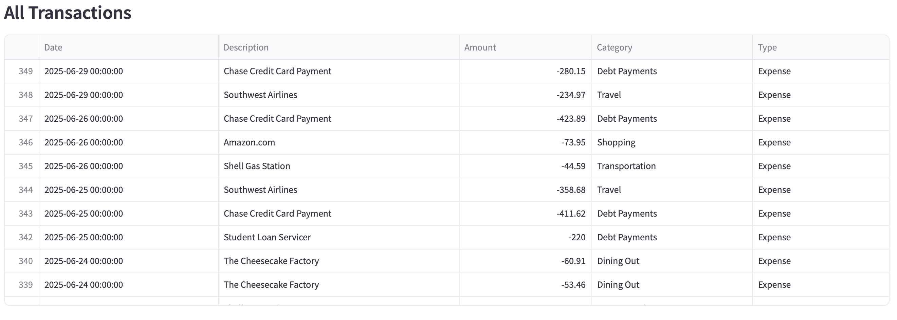

# Personal Budget Dashboard

A budget analysis tool that takes a raw bank/credit card CSV export and turns it into:
- An auto-categorized transaction dataset
- An Excel workbook with pivot-style summaries and charts
- An interactive Streamlit dashboard

## Features
- Auto-categorizes transactions into 15 spending categories using keyword matching
- Detects recurring charges and distinguishes true fixed subscriptions from irregular repeat spending
- Excel workbook with formula-driven (SUMIFS) monthly summaries — no hardcoded numbers
- Interactive dashboard: KPI cards, spending breakdown, income vs. expenses trend, category trends over time

## How to run

```bash
pip install -r requirements.txt
streamlit run app.py
```

Then upload a transaction CSV (Date, Description, Amount columns), or use the included `sample_transactions.csv` to try it out.

## Built with
Python, pandas, Streamlit, Plotly, openpyxl

## Screenshots

**Overview — KPIs and spending breakdown**


**Monthly spending trends by category**



**Detected recurring charges**


**All Transactions**

